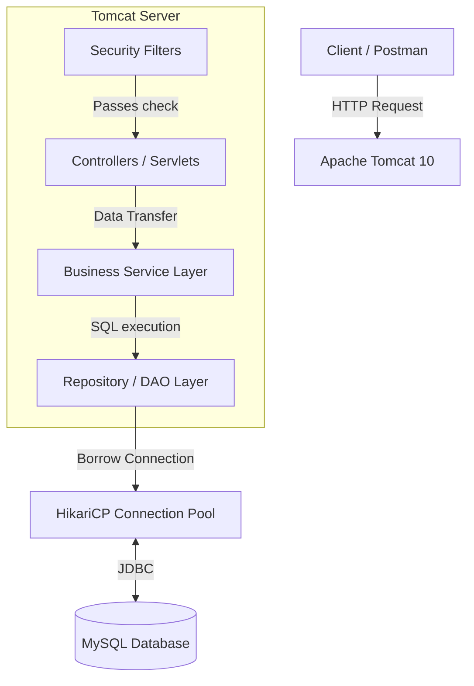
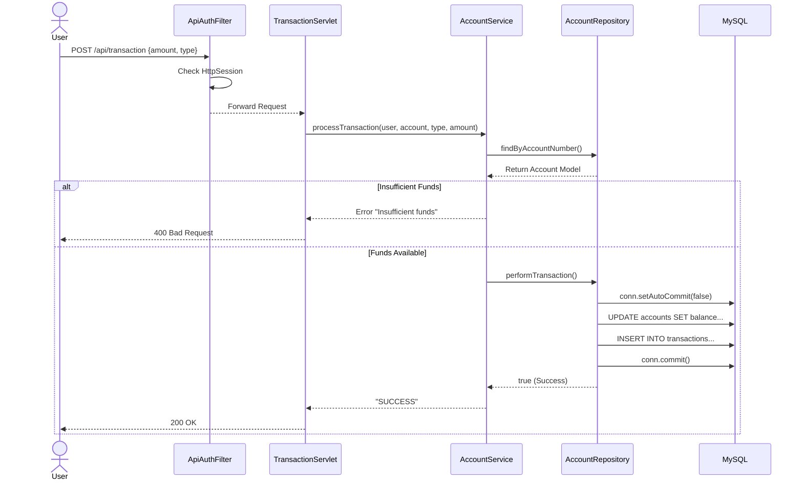

# Java Servlet Banking API

A robust, enterprise-grade banking API built entirely from scratch using raw Java Servlets. This project demonstrates a deep understanding of backend fundamentals, layered architecture, state management, and database connection pooling without relying on heavy frameworks like Spring Boot.

## 🚀 Features
* **Custom Security:** Password hashing via BCrypt and stateful authentication using Server-Side Sessions.
* **Role-Based Access Control (RBAC):** Servlet Filters dynamically guard endpoints based on 'USER' or 'ADMIN' roles.
* **ACID Transactions:** Manual JDBC transaction management (`commit`/`rollback`) ensuring zero data loss during account transfers.
* **Optimized Database:** Centralized connection pooling via HikariCP.
* **Automated Migrations:** Database schema version control powered by Liquibase.

## 🛠️ Technology Stack
* **Language:** Java 21
* **Server:** Apache Tomcat 10 (Jakarta EE 10)
* **Database:** MySQL 8.0
* **Build Tool:** Maven
* **Core Libraries:** Jakarta Servlet API, HikariCP, Liquibase, JBCrypt

---

## 🏗️ System Architecture

The application strictly follows a 3-Tier Layered Architecture to separate HTTP traffic, business rules, and database execution.



---

## 🔄 Sequence Diagram: Secure Transaction Flow

Here is how the system safely processes a debit/credit request, ensuring Atomicity.



---

## ⚙️ Local Setup Instructions

1. **Clone the repository:**
   ```bash
   git clone https://github.com/yourusername/servlet-banking-api.git
   ```
2. **Configure the Database:**
   * Create a MySQL database named `bank_db`.
   * Update the credentials in `src/main/resources/application.properties`.
3. **Run Migrations:**
   * Liquibase is configured to run automatically on server startup. It will create the necessary `users`, `accounts`, and `transactions` tables.
4. **Deploy:**
   * Run the project on an Apache Tomcat 10+ server using Java 21.

---
*Developed by Seyad Abdur Raheem*