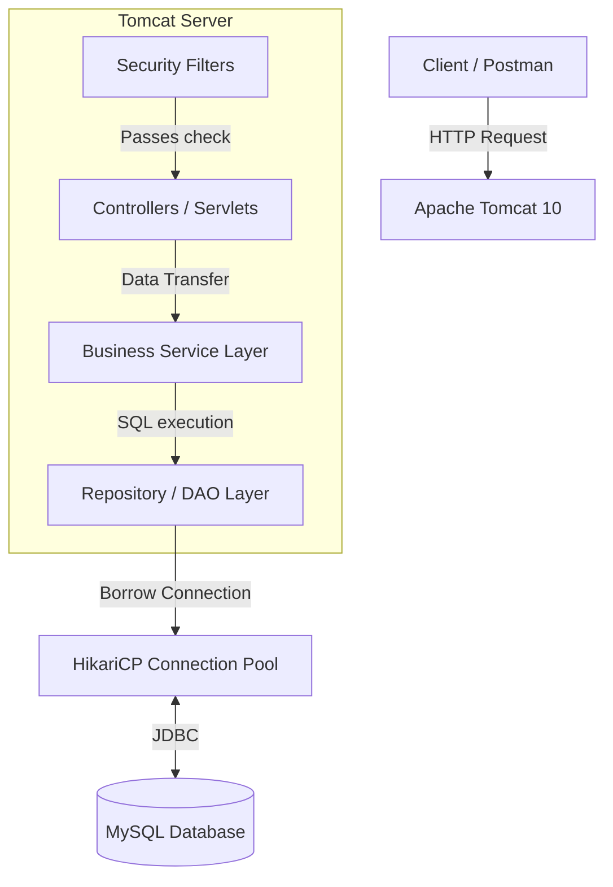
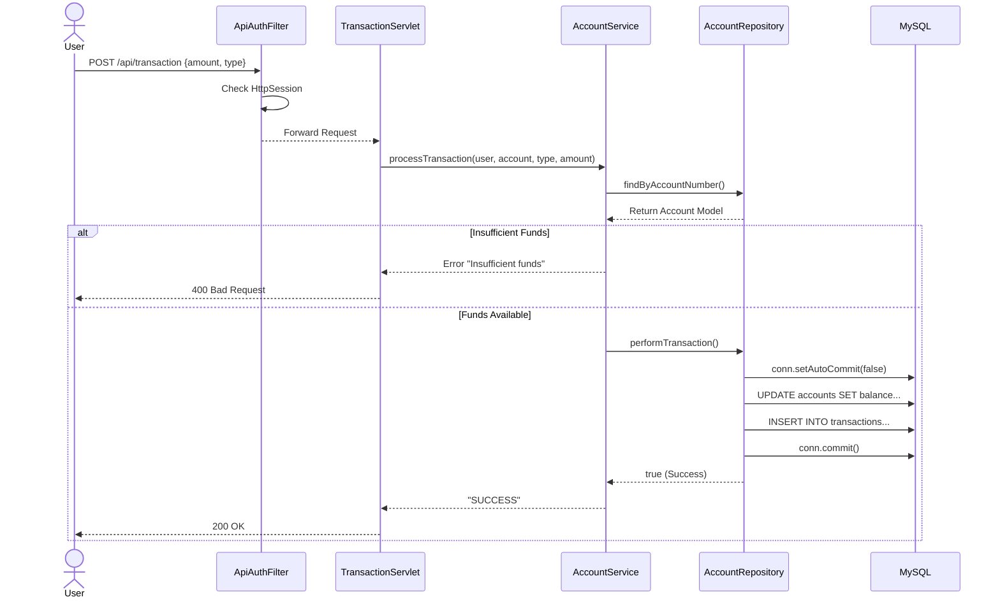
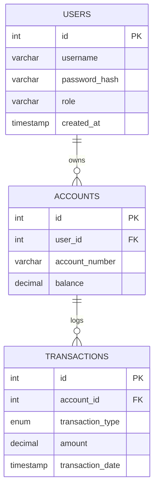

# Java Servlet Banking API

A simple banking API built entirely from scratch using raw Java Servlets. The project contains user and admin role, where users can make credit and debit transactions to accounts they own. Apart from this, they can view their transaction history. This project does not rely on heavy frameworks like Spring Boot.

##  Features
* **Custom Security:** Password hashing via BCrypt and stateful authentication using Server-Side Sessions.
* **Role-Based Access Control (RBAC):** Servlet Filters dynamically guard endpoints based on 'USER' or 'ADMIN' roles.
* **ACID Transactions:** Manual JDBC transaction management (`commit`/`rollback`) ensuring zero data loss during account transfers.
* **Optimized Database:** Centralized connection pooling via HikariCP.
* **Automated Migrations:** Database schema version control powered by Liquibase.

##  Technology Stack
* **Language:** Java 21
* **Server:** Apache Tomcat 10 (Jakarta EE 10)
* **Database:** MySQL 8.0
* **Build Tool:** Maven
* **Core Libraries:** Jakarta Servlet API, HikariCP, Liquibase, JBCrypt

---

##  System Architecture

The application strictly follows a 3-Tier Layered Architecture to separate HTTP traffic, business rules, and database execution.



---

##  Sequence Diagram: Secure Transaction Flow

Here is how the system safely processes a debit/credit request, ensuring Atomicity.



---

### Entity Relationship (One to Many)



### API Endpoints Summary

**Endpoint URL:** [Localhost Postman API Endpoints](http://localhost:8080/YourProjectName)

| S.No | Endpoint | Method | Inputs Needed | Description |
| :--- | :--- | :--- | :--- | :--- |
| 1 | `/health` | `GET` | `null` | Checks if the server is up and running. |
| 2 | `/register` | `POST` | `username`, `password` | Registers a new user, hashes password, and assigns default 'USER' role. |
| 3 | `/login` | `POST` | `username`, `password` | Authenticates user credentials and generates a secure session. |
| 4 | `/api/accounts/create` | `POST` | `null` | Generates a new unique account number for the logged-in user with a $0.00 balance. |
| 5 | `/api/transaction` | `POST` | `accountNumber`, `type`, `amount` | Debits or credits money after verifying account ownership and sufficient funds. |
| 6 | `/api/accounts` | `GET` | `null` | Retrieves a list of all accounts and their current balances for the user. |
| 7 | `/api/transactions` | `GET` | `page`, `size` *(query)* | Gives a paginated list of all transactions made by the logged-in user. |
| 8 | `/admin/dashboard` | `GET` | `null` | Gives the list of all accounts and system balances (Admin access only). |

---

**Credentials in `application.properties`**
* `db.url` = Your database url (e.g., `jdbc:mysql://localhost:3306/bank_db`).
* `db.username` = Your database username (e.g., `root`).
* `db.password` = Your database password.

##  Local Setup Instructions

1. **Clone the repository:**
   ```bash
   git clone https://github.com/seyad-exe/ServletBank.git
   ```
2. **Configure the Database:**
   * Create a MySQL database named `bank_db`.
   * Update the credentials in `src/main/resources/application.properties`.
3. **Run Migrations:**
   * Liquibase is configured to run automatically on server startup. It will create the necessary `users`, `accounts`, and `transactions` tables.
4. **Deploy:**
   * Run the project on an Apache Tomcat 10+ server using Java 21.

---
*Developed by Seyad Abdur Raheem*